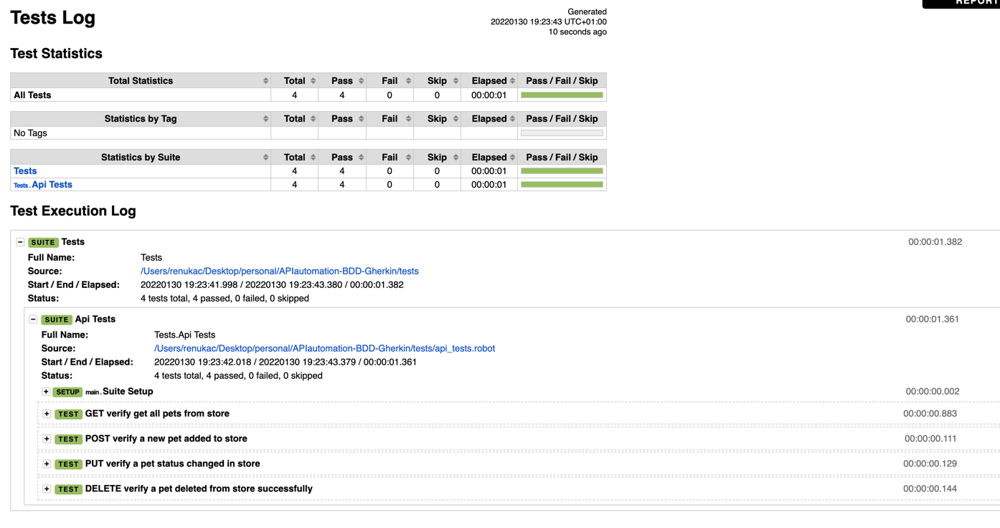

# API documentation

## SUT (system or subject under test)
Swagger.io petstore: https://petstore.swagger.io/

# Details
This framework is using page object model as a pattern structure and BDD (Behavior Driven Development) framework as a testing approach with single gherkin language. It's using 4 folders and 1 file in the root directory.
Furthermore, Data driven approach can also be integrated in this framework
* **requests folder**
    * This folder contains all json requests in separate files
* **steps folder**
    * This folder contains files that initiate any reusable steps.
    * Its steps should have direct relations to specific test files.
* **tests folder**
    * This folder contains testcases
    * It can also contain some reusable steps for specific test cases that use data-driven or gherkin language on the same test files.
* **resources.robot file**
    * This is file for global setup or any reusable logic or steps that are used in steps or test files.
* **result folder**
    * This folder is for saving test results after execution

---

## Setup pre-requisites
### Homebrew
1. Install _[Homebrew](https://brew.sh/)_ in _Terminal_ using the following command
  ```sh
  $ /usr/bin/ruby -e "$(curl -fsSL https://raw.githubusercontent.com/Homebrew/install/master/install)"
  ```

### Chromedriver
1. Install _[Chromedriver](https://chromedriver.chromium.org/)_ using _brew_ in _Terminal_ using the following command
  ```sh
  $ brew install chromedriver --cask
  ```

### Python
1. Install _[Python](https://www.python.org/)_ using _brew_ in _Terminal_ using the following command
  ```sh
  $ brew install python
  ```

### Setup Python Path
1. Create and open your .bash_profile or .zshrc from _Terminal_
  ```sh
  $ cd
  $ touch .bash_profile
  $ open -e .bash_profile
  ```
2. Set the _python_ PATH in .bash_profile file
  ```
  PATH="/usr/local/opt/python/libexec/bin:${PATH}"
  export PATH;
  ```
3. Save and exit your bash_profile

### Robot Framework
1. Install _[Robot Framework](https://robotframework.org/)_ using _pip_ in _Terminal_ using the following command
  ```sh
  $ pip install robotframework
  ```

### Selenium Library
1. Install _[Selenium Library in Robot Framework](https://github.com/robotframework/SeleniumLibrary)_ using _pip_ in _Terminal_ using the following command
  ```sh
  $ pip install robotframework-seleniumlibrary
  ```

---

## Execution process
1. Install python 3.9 from https://www.python.org/downloads/
2. Install python robotframework library with command "pip install robotframework"
3. Install robotframework requests library for API calls with command "pip install robotframework-requests"
4. open a new terminal execute robot framework suite with command "robot -d result/ tests/"
5. Finally test results can be referred in terminal output and log.html after execution is finished


